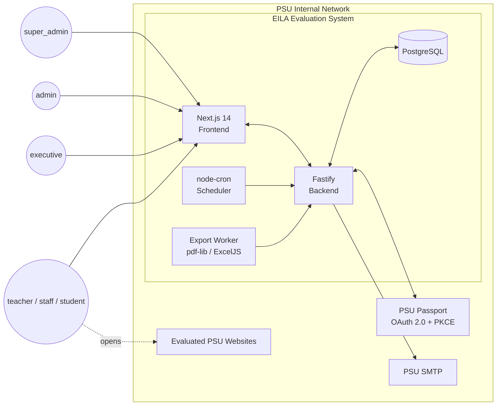

# Architecture

System-level overview of the EILA Website Evaluation System. For per-layer
details see the other docs in this folder.

SRS source: [`../../SRS2.0.md`](../../SRS2.0.md) §2 (Overall Description)
and §5 (Constraints).

## 1. System Context `[P1]`

**Actors** — six PSU-internal roles only. No anonymous public
respondents (SRS2.0 §1.2 exclusion).

**External systems** — PSU Passport for identity, PSU SMTP for email,
evaluated websites (opened in a new browser tab by evaluators).

## 2. Layered Architecture `[P1]`

| Layer | Responsibility | Depends on |
|---|---|---|
| Frontend | Next.js 14 App Router, server + client components, Zod forms | API (HTTP), browser storage (access token) |
| Backend | Fastify + Node.js; domain modules (auth / website / round / form / response / template / notification / report / admin) | DB, PSU Passport, SMTP |
| Database | PostgreSQL; Drizzle ORM; audit hash chain | — |
| Scheduler | node-cron; runs URL validation, auto-open / auto-close forms, reminder emails, audit purge | Backend services |
| Export Worker | pdf-lib (PDF reports), ExcelJS (data exports, ranking) | Backend query services |

The frontend and backend deploy as two separate Node processes behind a
single reverse proxy; the scheduler runs inside the backend process (or
a dedicated worker; see `deployment.md`).

## 3. Tech Stack & Rationale

| Layer | Tech | Rationale |
|---|---|---|
| Frontend framework | Next.js 14 App Router | SSR for admin pages with strict authorization, good accessibility primitives |
| Styling | Tailwind CSS | Constrained design tokens, fits WCAG contrast workflow |
| Drag-drop | dnd-kit | Keyboard alternative baked in (NFR-ACCESS-04) |
| Forms | React Hook Form + Zod | NFR-MAINT-02 mandates shared Zod schema FE/BE |
| Backend framework | Fastify | Lightweight, schema-first, good JWT + rate-limit plugins |
| ORM | **Drizzle** | Deviation from SRS2.0 Prisma mandate; see README deviation log |
| Database | PostgreSQL | Row-level security via app-layer guards, JSON for flexible answers |
| Auth | PSU Passport OAuth 2.0 + PKCE, JWT + refresh rotation | FR-AUTH-01..20 |
| Scheduler | node-cron | §5.1 technical constraint |
| Export | pdf-lib + ExcelJS | §5.1 technical constraint |
| Validation | Zod | Shared FE / BE per NFR-MAINT-02 |
| Logging | pino JSON | Structured for observability |

## 4. Cross-Cutting Concerns

- **Logging** — pino JSON at the backend; frontend errors shipped via a
  small `/api/v1/logs/client` endpoint.
- **Error handling** — unified error envelope
  `{error: {code, message, details}}`; see `api-contracts.md` §Conventions.
- **i18n** `[P3]` — Thai default, English secondary (Phase 3); keep copy
  in message catalogs from day one even though Phase 1 ships Thai only.
- **Timezone** — all times persisted as UTC `timestamptz`; rendered in
  `Asia/Bangkok`.
- **Accessibility** — WCAG 2.1 AA across Phase 1 and Phase 2 (NFR-ACCESS).
  Details in `component-tree.md`.
- **PDPA** — retention, anonymization, and user-initiated deletion workflow
  live in `data-lifecycle.md`.
- **Authorization** — enforced at middleware and at the query layer
  (NFR-SEC-08). Design in `security.md`.

## 5. Phase Boundaries

SRS2.0 Appendix E:

- **Phase 1** `[P1]` — auth, registry, rounds, form builder, criteria
  presets, evaluator view, response submission, basic dashboard, JSON +
  Excel export, audit, PDPA, backup.
- **Phase 2** `[P2]` — ranking (Top 10 / Bottom 5 / Most Improved),
  full score card, per-website PDF report, email delivery status, trend,
  faculty heatmap.
- **Phase 3** `[P3]` — conditional logic, auto screenshot, AI summary,
  public API, multi-language UI, advanced analytics, benchmarking.

Phase tags appear on specific components (for example, the PDF report
pipeline is marked `[P2]` in `deployment.md`).

## 6. NFR → Design-Doc Map

| NFR group | Primary doc |
|---|---|
| NFR-SEC (Security) | `security.md` |
| NFR-PERF (Performance) | `deployment.md` (§Observability, §Scheduler) + `api-contracts.md` (§Conventions) |
| NFR-AVAIL (Availability / DR) | `deployment.md` |
| NFR-ACCESS (Accessibility) | `component-tree.md` |
| NFR-MAINT (Maintainability) | This doc (§Tech Stack) + `db-schema.md` + `api-contracts.md` |
| PDPA / Audit (FR-DATA, FR-AUDIT) | `data-lifecycle.md` |
| Scoring (FR-CRIT, FR-DASH, FR-RANK) | `scoring-and-ranking.md` |
