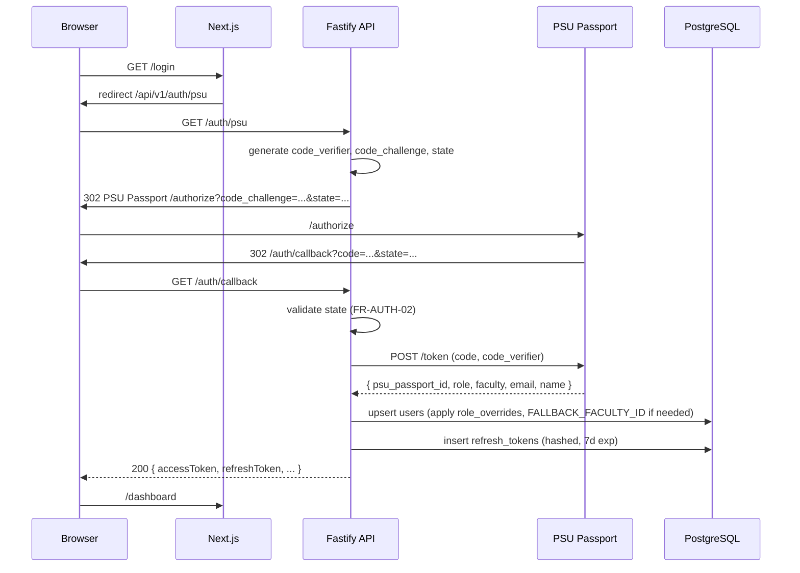
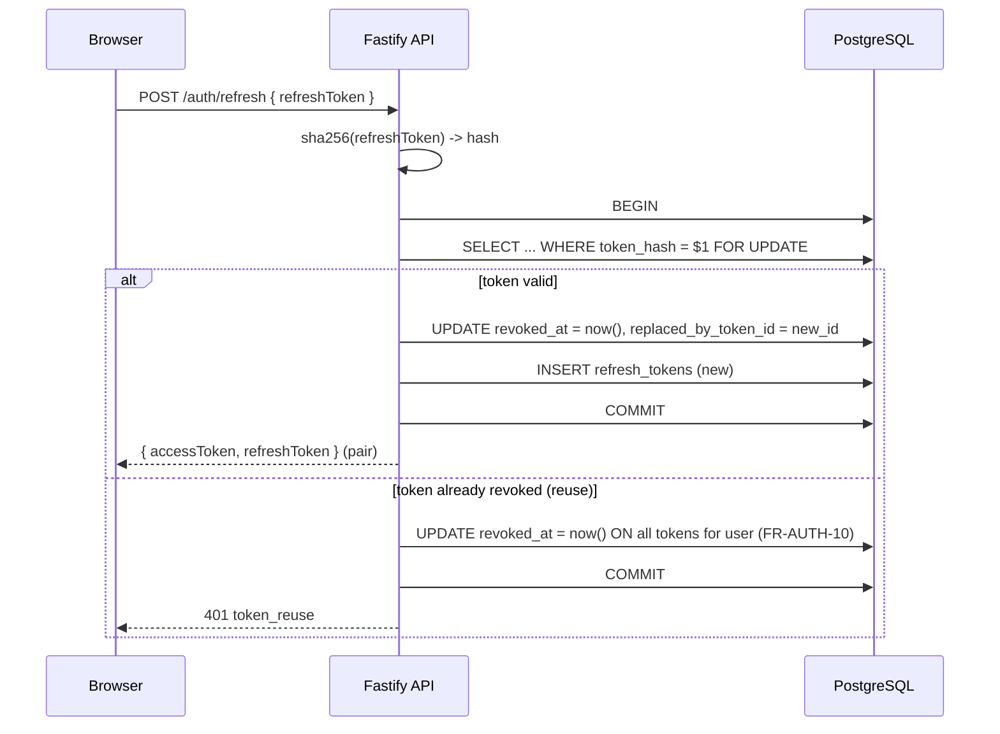
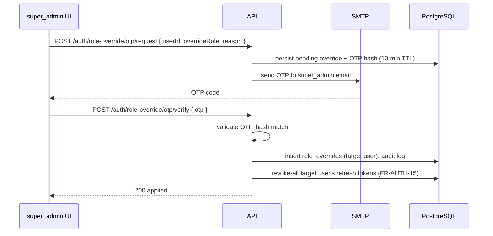

# Auth Flow

Implements SRS2.1 FR-AUTH-01..20. Covers PSU Passport OAuth 2.0 + PKCE,
JWT access + refresh-token rotation with reuse detection, timeout
policy, and email-OTP role override for `super_admin`.

## 1. Login Sequence `[P1]`

Key rules:

- `state` validated every callback (FR-AUTH-02).
- PSU-missing `faculty_id` → `FALLBACK_FACULTY_ID`; user sees only
  `university`-scope data (FR-AUTH-04).
- PSU-missing `role` → default `student` (FR-AUTH-05).
- Teacher / staff / student auto-provisioned on first login (FR-USER-02).

## 2. Token Lifetimes `[P1]`

| Token | TTL | Storage |
|---|---|---|
| Access token | 15 min (FR-AUTH-06) | Memory (frontend) |
| Refresh token | 7 days (FR-AUTH-07) | HttpOnly + Secure + SameSite=Strict cookie OR client-managed via `Authorization`-less endpoint; hashed in DB (FR-AUTH-08) |

Recommendation: keep the access token in JS memory (never localStorage)
and the refresh token in an HttpOnly cookie scoped to `/api/v1/auth/*`
paths. This is XSS-resistant and matches the CSRF posture in
`security.md`.

## 3. Refresh Rotation `[P1]`

- Rotation is a single atomic transaction (FR-AUTH-09).
- Reuse detection triggers revoke-all for the user and an audit event
  (`auth.token_reuse_detected`).

## 4. Timeouts `[P1]`

- Idle timeout: 30 min of no authenticated API call (FR-AUTH-16).
  Tracked by refresh-token `last_used_at` or a dedicated `sessions`
  view (implementation detail).
- Absolute timeout: 8 h per login session (FR-AUTH-17). Enforced by
  refresh-token `max_session_end_at` alongside `expires_at`.
- Frontend warning dialog 5 min before idle expiry with a count-down
  (FR-AUTH-18). Component in `component-tree.md`.
- Session expiry redirects to `/login?redirect=<current_path>`
  (FR-AUTH-19).

## 5. Logout & Revoke-All `[P1]`

| Endpoint | Effect |
|---|---|
| `POST /auth/logout` | Revokes the refresh token presented with the request (FR-AUTH-12) |
| `POST /auth/revoke-all` | Sets `revoked_at = now()` on all of the user's non-revoked refresh tokens (FR-AUTH-13) |

Triggers for automatic revoke-all:

- User soft-deleted (FR-AUTH-14, FR-USER-07).
- Role override applied (FR-AUTH-15).
- Refresh-token reuse detected (FR-AUTH-10).

## 6. Role Override via Email OTP `[P1]`

Only `super_admin` may trigger this flow (FR-AUTH-20).

OTP policy:

- 6-digit numeric, single-use.
- 10-minute TTL.
- Repeated failed attempts counted; 5 failures within 15 min locks the
  OTP for the target override (security event logged, NFR-SEC-09).

## 7. Failure Modes

| Scenario | Behavior |
|---|---|
| PSU Passport unreachable | `/auth/callback` returns 502; login page shows retry. |
| `state` mismatch | 400; callback aborted; audit `auth.state_mismatch`. |
| `code_verifier` mismatch | 400; audit. |
| Refresh token expired | 401 unauthenticated; user re-logins. |
| Refresh token reused | 401 token_reuse + revoke-all + audit. |
| Role override pending for logged-in user | Next refresh returns new token with updated role; forced logout on stale token. |
| User soft-deleted mid-session | Next API call returns 401; tokens revoked (FR-USER-07). |

## 8. Audit Events Emitted

| Event | Trigger |
|---|---|
| `auth.login` | Successful `/auth/callback` |
| `auth.logout` | `/auth/logout` |
| `auth.revoke_all` | `/auth/revoke-all` |
| `auth.token_reuse_detected` | Reuse path in §3 |
| `auth.state_mismatch` | §7 |
| `auth.role_override_requested` | OTP request |
| `auth.role_override_applied` | OTP verify success |
| `auth.role_override_locked` | OTP failure lockout |
