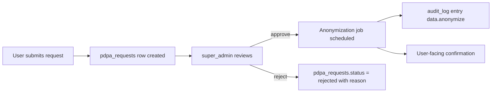

# Data Lifecycle, PDPA, and Audit

Implements SRS2.0 FR-DATA-01..10 and FR-AUDIT-01..08.

## 1. Soft Delete `[P1]`

| Entity | Soft-delete column | Notes |
|---|---|---|
| `users` | `deleted_at` | Hides from operational lists (FR-USER-06); revokes tokens (FR-USER-07) |
| `forms` | `deleted_at` | Hidden from admin lists; responses remain for history |
| `responses` | `deleted_at` | Hidden from dashboards |
| `response_answers` | (via response) | No separate soft-delete column — always deleted with parent response |
| `website_targets` | `deleted_at` | Hidden from selection list (FR-WEB-10) |
| `evaluation_rounds` | `deleted_at` | Hidden from filters |
| `templates` | `deleted_at` | Already-created forms unaffected |

Operational list rule: every query defaults to `WHERE deleted_at IS
NULL` unless the caller is an admin explicitly asking for deleted rows
(FR-DATA-10).

## 2. Retention Policy `[P1]`

| Entity | Primary retention | Beyond primary | Reference |
|---|---|---|---|
| User (soft-deleted) | 7 years | Anonymize then hard-delete | FR-DATA-02 |
| Form, EvaluationRound (soft-deleted) | 7 years | Hard-delete | FR-DATA-02 |
| Response, Answer | 7 years | Anonymize PII, keep aggregate for stats | FR-DATA-03 |
| WebsiteTarget (soft-deleted) | Indefinite via archive view | — | FR-DATA-04 |
| RefreshToken (expired) | Immediate hard-delete by cron | — | FR-DATA-05 |
| AuditLog | 2 years primary | Archive to 7 years, then purge | FR-DATA-06, FR-AUDIT-05 |

Scheduler job schedule in `deployment.md` §5. Every lifecycle action
writes an audit log entry (FR-DATA-09).

## 3. Anonymization Rules `[P1]`

When a user (or their personal data in responses) reaches retention or
is approved under a PDPA request:

| Field | Action |
|---|---|
| `users.psu_passport_id` | Replace with `anon:<random>` |
| `users.email` | Set to null (encrypted at rest until then) |
| `users.display_name` | Set to `"ผู้ใช้ไม่ระบุชื่อ"` or equivalent locale-aware placeholder |
| `responses.user_id` | Keep FK but user row is anonymized; scoring still works |
| `response_answers.value_text` | Preserved as aggregate; PII scrub pass (pattern-based) for free-text before export |
| `audit_log` | Replace `user_id` on old rows with null; keep action + entity for traceability |

Anonymization is irreversible; record the anonymization event as its
own audit log entry (`data.anonymize`).

## 4. PDPA Delete Workflow `[P1]`



Supporting table:

```sql
CREATE TABLE pdpa_requests (
  id UUID PK,
  user_id UUID NOT NULL REFERENCES users(id),
  status TEXT NOT NULL CHECK (status IN ('pending','approved','rejected','completed')),
  reason TEXT,
  requested_at TIMESTAMPTZ NOT NULL DEFAULT now(),
  reviewed_by_id UUID REFERENCES users(id),
  reviewed_at TIMESTAMPTZ,
  completed_at TIMESTAMPTZ
);
```

Legal hold (FR-DATA-08): certain data is retained even after approval
if law requires (for example, audit records for government audit
timelines). Retention rules above already account for this.

## 5. Audit Log `[P1]`

### 5.1 Covered actions

At minimum (FR-AUDIT-01, FR-AUDIT-08):

| Action class | Examples |
|---|---|
| auth | `auth.login`, `auth.logout`, `auth.revoke_all`, `auth.token_reuse_detected`, `auth.role_override_requested`, `auth.role_override_applied` |
| form lifecycle | `form.create`, `form.update`, `form.publish`, `form.unpublish`, `form.close`, `form.duplicate`, `form.rollback`, `form.delete` |
| website | `website.create`, `website.update`, `website.delete`, `website.url_status_changed` |
| round | `round.create`, `round.update`, `round.close`, `round.delete` |
| template | `template.create`, `template.update`, `template.deprecate`, `template.clone`, `template.delete` |
| user | `user.create`, `user.update`, `user.import`, `user.delete`, `user.role_override` |
| response | `response.submit` (only non-null, with metadata), `response.update` |
| export | `export.pdf.website`, `export.xlsx.form`, `export.xlsx.ranking`, `export.summary.pdf` |
| data lifecycle | `data.soft_delete`, `data.anonymize`, `data.archive`, `data.purge` |
| security | `security.rate_limit_hit`, `security.csp_violation` |

### 5.2 Schema reminder

See `db-schema.md` §9.1. Each row carries `prev_hash` and `hash`.

### 5.3 Hash algorithm

```
hash = sha256(
  prev_hash ||
  id ||
  coalesce(user_id, '') ||
  action ||
  entity_type ||
  coalesce(entity_id, '') ||
  coalesce(old_value::text, '') ||
  coalesce(new_value::text, '') ||
  coalesce(ip::text, '') ||
  created_at::text
)
```

- `prev_hash` is the `hash` of the previous row (ordered by `id`).
- The very first row uses a deterministic seed (`genesis:<env>:<deploy>`).
- Rows are append-only; no UPDATE or DELETE in the application layer.
  DBAs may archive, but archival is a copy-then-insert to a separate
  `audit_log_archive` table and then `DELETE` under a documented
  window (see §5.5).

### 5.4 Verification `[P1]`

`GET /api/v1/audit-log/verify` (see `api-contracts.md` §11):

1. Pull rows in ID order for a window (`?from` / `?to` or full).
2. Recompute hash for each row using stored fields.
3. Compare to `hash`; on first mismatch, return 422 with the row id.
4. On success, return `{ status: 'pass', count, windowStart, windowEnd }`.

### 5.5 Archive & Purge `[P1]`

Daily cron at 03:00 (FR-AUDIT-06):

1. Copy rows older than 2 years to `audit_log_archive`.
2. Verify archive hash continuity (genesis seed + chain check).
3. Delete archived rows from `audit_log`.
4. Rows older than 7 years are purged from the archive too.

## 6. Import / Export Considerations

- Form JSON export never includes response data (FR-IE-04).
- User XLSX import validates file type, row count, required columns,
  faculty existence before writing anything (FR-USER-04).
- Website XLSX import follows the same validation pattern (FR-WEB-07).

## 7. Coverage Matrix

| FR | Where implemented |
|---|---|
| FR-DATA-01 | §1 Soft Delete |
| FR-DATA-02 | §2 Retention |
| FR-DATA-03 | §2, §3 Anonymization |
| FR-DATA-04 | §2 |
| FR-DATA-05 | §2, `deployment.md` §5 scheduler |
| FR-DATA-06 | §5.5 Archive |
| FR-DATA-07 | §4 PDPA |
| FR-DATA-08 | §3, §4 |
| FR-DATA-09 | Every action writes audit (§5.1) |
| FR-DATA-10 | §1 operational list rule |
| FR-AUDIT-01 | §5.1 |
| FR-AUDIT-02 | §5.3 |
| FR-AUDIT-03 | `db-schema.md` §9.1 |
| FR-AUDIT-04 | `api-contracts.md` §11 |
| FR-AUDIT-05 | §5.5 |
| FR-AUDIT-06 | §5.5 and `deployment.md` §5 |
| FR-AUDIT-07 | §5.4 verify endpoint |
| FR-AUDIT-08 | §5.1 covered actions |
