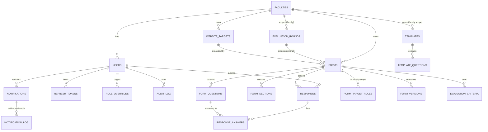

# Database Schema

PostgreSQL via Drizzle ORM. Entity coverage follows SRS2.1 Appendix A plus
dependents needed by the functional requirements.

**Convention** — every table carries `id UUID PRIMARY KEY DEFAULT gen_random_uuid()`,
`created_at TIMESTAMPTZ NOT NULL DEFAULT now()`, `updated_at TIMESTAMPTZ NOT NULL DEFAULT now()`
(trigger-maintained), and where soft delete applies, `deleted_at TIMESTAMPTZ NULL`
(FR-DATA-01). These three columns are omitted from per-table listings
below to keep them readable.

Drizzle is the canonical ORM in SRS2.1.

## 1. Enums `[P1]`

```ts
export const roleEnum = pgEnum('role', [
  'super_admin', 'admin', 'executive', 'teacher', 'staff', 'student',
]);

export const formScopeEnum = pgEnum('form_scope', ['faculty', 'university']);
export const templateScopeEnum = pgEnum('template_scope', ['faculty', 'global']);
export const roundScopeEnum = pgEnum('round_scope', ['faculty', 'university']);
export const roundStatusEnum = pgEnum('round_status', ['draft', 'active', 'closed']);
export const formStatusEnum = pgEnum('form_status', ['draft', 'open', 'closed']);
export const questionTypeEnum = pgEnum('question_type', [
  'short_text', 'long_text', 'single_choice', 'multi_choice',
  'rating', 'scale_5', 'scale_10', 'boolean', 'date', 'number',
]);
export const urlStatusEnum = pgEnum('url_status', ['unknown', 'ok', 'unreachable']);
export const notificationChannelEnum = pgEnum('notification_channel', ['email', 'in_app']);
export const notificationStatusEnum = pgEnum('notification_status', [
  'pending', 'sent', 'failed', 'retrying',
]);
```

## 2. ERD `[P1]`



## 3. Tables — Identity & Access `[P1]`

### 3.1 `faculties`

```ts
export const faculties = pgTable('faculties', {
  id: uuid('id').primaryKey().defaultRandom(),
  code: text('code').notNull().unique(),
  nameTh: text('name_th').notNull(),
  nameEn: text('name_en').notNull(),
  deletedAt: timestamp('deleted_at', { withTimezone: true }),
  // created_at / updated_at omitted
});
```

```sql
CREATE TABLE faculties (
  id          UUID        PRIMARY KEY DEFAULT gen_random_uuid(),
  code        TEXT        NOT NULL UNIQUE,
  name_th     TEXT        NOT NULL,
  name_en     TEXT        NOT NULL,
  deleted_at  TIMESTAMPTZ,
  created_at  TIMESTAMPTZ NOT NULL DEFAULT now(),
  updated_at  TIMESTAMPTZ NOT NULL DEFAULT now()
);
```

Notes: `code` is the PSU-published faculty code.
`FALLBACK_FACULTY_ID` (FR-AUTH-04) points to a reserved row with
`code = 'FALLBACK'`.

### 3.2 `users`

```ts
export const users = pgTable('users', {
  id: uuid('id').primaryKey().defaultRandom(),
  psuPassportId: text('psu_passport_id').notNull().unique(),
  email: text('email').notNull(),
  role: roleEnum('role').notNull().default('student'),
  facultyId: uuid('faculty_id').notNull().references(() => faculties.id),
  displayName: text('display_name').notNull(),
  lastLoginAt: timestamp('last_login_at', { withTimezone: true }),
  deletedAt: timestamp('deleted_at', { withTimezone: true }),
});
```

```sql
CREATE TABLE users (
  id               UUID        PRIMARY KEY DEFAULT gen_random_uuid(),
  psu_passport_id  TEXT        NOT NULL UNIQUE,
  email            TEXT        NOT NULL,
  role             role        NOT NULL DEFAULT 'student',
  faculty_id       UUID        NOT NULL REFERENCES faculties(id),
  display_name     TEXT        NOT NULL,
  last_login_at    TIMESTAMPTZ,
  deleted_at       TIMESTAMPTZ,
  created_at       TIMESTAMPTZ NOT NULL DEFAULT now(),
  updated_at       TIMESTAMPTZ NOT NULL DEFAULT now()
);
CREATE INDEX users_faculty_id_idx ON users(faculty_id) WHERE deleted_at IS NULL;
CREATE INDEX users_role_idx       ON users(role)       WHERE deleted_at IS NULL;
```

Notes: `super_admin` rows still require `faculty_id`; point them at the
`FALLBACK` row. `email` is encrypted at rest at the application layer
(NFR-SEC-07).

### 3.3 `role_overrides`

```ts
export const roleOverrides = pgTable('role_overrides', {
  id: uuid('id').primaryKey().defaultRandom(),
  userId: uuid('user_id').notNull().references(() => users.id),
  overrideRole: roleEnum('override_role').notNull(),
  reason: text('reason').notNull(),
  approvedBy: uuid('approved_by').notNull().references(() => users.id),
  expiresAt: timestamp('expires_at', { withTimezone: true }),
});
```

Supports FR-AUTH-15 (override → revoke-all tokens) and FR-AUTH-20 (OTP).

### 3.4 `refresh_tokens`

```ts
export const refreshTokens = pgTable('refresh_tokens', {
  id: uuid('id').primaryKey().defaultRandom(),
  userId: uuid('user_id').notNull().references(() => users.id),
  tokenHash: text('token_hash').notNull().unique(),
  expiresAt: timestamp('expires_at', { withTimezone: true }).notNull(),
  revokedAt: timestamp('revoked_at', { withTimezone: true }),
  replacedByTokenId: uuid('replaced_by_token_id'),
  userAgent: text('user_agent'),
  ip: inet('ip'),
});
```

Notes: `token_hash` stores SHA-256 of the refresh token (FR-AUTH-08).
Atomic rotation = single UPDATE setting `revoked_at` and
`replaced_by_token_id` in one transaction (FR-AUTH-09).

## 4. Tables — Website Registry & Rounds `[P1]`

### 4.1 `website_targets`

```ts
export const websiteTargets = pgTable('website_targets', {
  id: uuid('id').primaryKey().defaultRandom(),
  name: text('name').notNull(),
  url: text('url').notNull(),
  category: text('category'),
  ownerFacultyId: uuid('owner_faculty_id').notNull().references(() => faculties.id),
  isActive: boolean('is_active').notNull().default(true),
  urlStatus: urlStatusEnum('url_status').notNull().default('unknown'),
  lastValidatedAt: timestamp('last_validated_at', { withTimezone: true }),
  deletedAt: timestamp('deleted_at', { withTimezone: true }),
});
```

Notes: FR-WEB-08 cron writes `url_status` and `last_validated_at`.
Soft-delete hides from selection lists by default (FR-WEB-10).

### 4.2 `evaluation_rounds`

```ts
export const evaluationRounds = pgTable('evaluation_rounds', {
  id: uuid('id').primaryKey().defaultRandom(),
  name: text('name').notNull(),
  academicYear: text('academic_year').notNull(),
  semester: text('semester'),
  openDate: timestamp('open_date', { withTimezone: true }),
  closeDate: timestamp('close_date', { withTimezone: true }),
  scope: roundScopeEnum('scope').notNull(),
  facultyId: uuid('faculty_id').references(() => faculties.id),
  status: roundStatusEnum('status').notNull().default('draft'),
  createdById: uuid('created_by_id').notNull().references(() => users.id),
  deletedAt: timestamp('deleted_at', { withTimezone: true }),
});
```

Constraints:

```sql
ALTER TABLE evaluation_rounds ADD CONSTRAINT round_faculty_scope_ck
  CHECK ( (scope = 'faculty' AND faculty_id IS NOT NULL)
       OR (scope = 'university' AND faculty_id IS NULL) );
```

## 5. Tables — Forms `[P1]`

### 5.1 `forms`

```ts
export const forms = pgTable('forms', {
  id: uuid('id').primaryKey().defaultRandom(),
  title: text('title').notNull(),
  description: text('description'),
  scope: formScopeEnum('scope').notNull(),
  ownerFacultyId: uuid('owner_faculty_id').references(() => faculties.id),
  websiteTargetId: uuid('website_target_id').references(() => websiteTargets.id),
  websiteUrl: text('website_url').notNull(),
  websiteName: text('website_name').notNull(),
  websiteOwnerFaculty: uuid('website_owner_faculty').references(() => faculties.id),
  evaluationRoundId: uuid('evaluation_round_id').references(() => evaluationRounds.id),
  status: formStatusEnum('status').notNull().default('draft'),
  openAt: timestamp('open_at', { withTimezone: true }),
  closeAt: timestamp('close_at', { withTimezone: true }),
  version: integer('version').notNull().default(1),
  createdById: uuid('created_by_id').notNull().references(() => users.id),
  deletedAt: timestamp('deleted_at', { withTimezone: true }),
});
```

Constraints:

```sql
-- Faculty-scope forms must have an owning faculty; university-scope forms must not.
ALTER TABLE forms ADD CONSTRAINT form_scope_faculty_ck
  CHECK ( (scope = 'faculty' AND owner_faculty_id IS NOT NULL)
       OR (scope = 'university' AND owner_faculty_id IS NULL) );
```

Notes: `website_url` mandatory (FR-FORM-02). `version` drives optimistic
locking (FR-FORM-17). `university` scope has no `form_target_roles`
(FR-FORM-12).

### 5.2 `form_sections` / `form_questions` / `form_target_roles` `[P1]`

```ts
export const formSections = pgTable('form_sections', {
  id: uuid('id').primaryKey().defaultRandom(),
  formId: uuid('form_id').notNull().references(() => forms.id),
  title: text('title').notNull(),
  orderIndex: integer('order_index').notNull(),
});

export const formQuestions = pgTable('form_questions', {
  id: uuid('id').primaryKey().defaultRandom(),
  formId: uuid('form_id').notNull().references(() => forms.id),
  sectionId: uuid('section_id').references(() => formSections.id),
  criterionId: uuid('criterion_id').references(() => evaluationCriteria.id),
  type: questionTypeEnum('type').notNull(),
  prompt: text('prompt').notNull(),
  config: jsonb('config').notNull().default(sql`'{}'::jsonb`),
  required: boolean('required').notNull().default(false),
  orderIndex: integer('order_index').notNull(),
});

export const formTargetRoles = pgTable('form_target_roles', {
  formId: uuid('form_id').notNull().references(() => forms.id),
  role: roleEnum('role').notNull(),
}, (t) => ({
  pk: primaryKey({ columns: [t.formId, t.role] }),
}));
```

### 5.3 `form_versions` `[P1]`

```ts
export const formVersions = pgTable('form_versions', {
  id: uuid('id').primaryKey().defaultRandom(),
  formId: uuid('form_id').notNull().references(() => forms.id),
  version: integer('version').notNull(),
  snapshot: jsonb('snapshot').notNull(),
  createdById: uuid('created_by_id').notNull().references(() => users.id),
}, (t) => ({
  unique: uniqueIndex('form_versions_form_version_uq').on(t.formId, t.version),
}));
```

Rollback (FR-FORM-20) creates a **new** draft form from a snapshot —
never overwrites the current form.

## 6. Tables — Criteria & Templates `[P1]`

### 6.1 `evaluation_criteria`

```ts
export const evaluationCriteria = pgTable('evaluation_criteria', {
  id: uuid('id').primaryKey().defaultRandom(),
  name: text('name').notNull(),
  description: text('description'),
  weight: numeric('weight', { precision: 5, scale: 2 }).notNull(),
  isPreset: boolean('is_preset').notNull().default(false),
  templateId: uuid('template_id').references(() => templates.id),
  formId: uuid('form_id').references(() => forms.id),
});
```

Notes: either `template_id` or `form_id` set (template-owned vs.
form-snapshot copy). Snapshot on form publish supports FR-CRIT-08 —
template updates do not mutate existing forms.

### 6.2 `templates` / `template_questions`

```ts
export const templates = pgTable('templates', {
  id: uuid('id').primaryKey().defaultRandom(),
  title: text('title').notNull(),
  scope: templateScopeEnum('scope').notNull(),
  ownerFacultyId: uuid('owner_faculty_id').references(() => faculties.id),
  ownerUserId: uuid('owner_user_id').references(() => users.id),
  deprecatedAt: timestamp('deprecated_at', { withTimezone: true }),
  deletedAt: timestamp('deleted_at', { withTimezone: true }),
});

export const templateQuestions = pgTable('template_questions', {
  id: uuid('id').primaryKey().defaultRandom(),
  templateId: uuid('template_id').notNull().references(() => templates.id),
  criterionId: uuid('criterion_id').references(() => evaluationCriteria.id),
  type: questionTypeEnum('type').notNull(),
  prompt: text('prompt').notNull(),
  config: jsonb('config').notNull().default(sql`'{}'::jsonb`),
  orderIndex: integer('order_index').notNull(),
});
```

Constraint mirrors forms — `faculty` scope needs `owner_faculty_id`;
`global` scope does not.

## 7. Tables — Responses `[P1]`

### 7.1 `responses`

```ts
export const responses = pgTable('responses', {
  id: uuid('id').primaryKey().defaultRandom(),
  formId: uuid('form_id').notNull().references(() => forms.id),
  userId: uuid('user_id').notNull().references(() => users.id),
  formOpenedAt: timestamp('form_opened_at', { withTimezone: true }),
  websiteOpenedAt: timestamp('website_opened_at', { withTimezone: true }),
  submittedAt: timestamp('submitted_at', { withTimezone: true }),
  deletedAt: timestamp('deleted_at', { withTimezone: true }),
}, (t) => ({
  unique: uniqueIndex('responses_form_user_uq').on(t.formId, t.userId),
}));
```

Notes: unique `(form_id, user_id)` enforces FR-RESP-05. Time columns
satisfy FR-EVAL-03, FR-EVAL-07.

### 7.2 `response_answers`

```ts
export const responseAnswers = pgTable('response_answers', {
  id: uuid('id').primaryKey().defaultRandom(),
  responseId: uuid('response_id').notNull().references(() => responses.id),
  questionId: uuid('question_id').notNull().references(() => formQuestions.id),
  valueNumber: numeric('value_number'),
  valueText: text('value_text'),
  valueJson: jsonb('value_json'),
}, (t) => ({
  unique: uniqueIndex('response_answers_response_question_uq').on(t.responseId, t.questionId),
}));
```

Notes: one of the value columns is populated per `questionType`. The
numeric column feeds weighted-average scoring (see
`scoring-and-ranking.md`).

## 8. Tables — Notifications `[P1]`

### 8.1 `notifications`

```ts
export const notifications = pgTable('notifications', {
  id: uuid('id').primaryKey().defaultRandom(),
  userId: uuid('user_id').notNull().references(() => users.id),
  kind: text('kind').notNull(),
  subject: text('subject').notNull(),
  body: text('body').notNull(),
  relatedFormId: uuid('related_form_id').references(() => forms.id),
  relatedWebsiteId: uuid('related_website_id').references(() => websiteTargets.id),
  readAt: timestamp('read_at', { withTimezone: true }),
  idempotencyKey: text('idempotency_key').notNull().unique(),
});
```

### 8.2 `notification_log` `[P2]` for delivery status surface

```ts
export const notificationLog = pgTable('notification_log', {
  id: uuid('id').primaryKey().defaultRandom(),
  notificationId: uuid('notification_id').notNull().references(() => notifications.id),
  channel: notificationChannelEnum('channel').notNull(),
  status: notificationStatusEnum('status').notNull(),
  attempt: integer('attempt').notNull().default(1),
  errorMessage: text('error_message'),
  deliveredAt: timestamp('delivered_at', { withTimezone: true }),
});
```

Retry schedule (FR-NOTIF-07) implemented by the scheduler using this
table's `attempt` column.

## 9. Table — Audit Log `[P1]`

### 9.1 `audit_log`

```ts
export const auditLog = pgTable('audit_log', {
  id: bigserial('id', { mode: 'bigint' }).primaryKey(),
  userId: uuid('user_id').references(() => users.id),
  action: text('action').notNull(),
  entityType: text('entity_type').notNull(),
  entityId: text('entity_id'),
  oldValue: jsonb('old_value'),
  newValue: jsonb('new_value'),
  ip: inet('ip'),
  prevHash: text('prev_hash'),
  hash: text('hash').notNull().unique(),
  createdAt: timestamp('created_at', { withTimezone: true }).notNull().defaultNow(),
});
```

Hash formula: `hash = sha256(prev_hash || id || user_id || action ||
entity_type || entity_id || old_value || new_value || ip || created_at)`.
See `data-lifecycle.md` §Audit for the full algorithm and the verify
endpoint (FR-AUDIT-07).

## 10. Migration Strategy

- Use `drizzle-kit generate` to produce SQL migrations from the
  TypeScript schema. Migrations are version-controlled under
  `db/migrations/` (final path set during scaffolding).
- Naming: `NNNN__<short_snake_description>.sql` where `NNNN` is a
  zero-padded sequence number.
- Every migration has a documented rollback plan in its header comment;
  destructive changes (drop column, rename table) require a two-stage
  migration (expand → migrate → contract).
- CI runs `drizzle-kit check` to detect drift between schema and
  migrations.

## 11. Retention Cross-Links

Soft-delete columns are enumerated in `data-lifecycle.md` §Retention.
Anonymization queries, purge cron, and archive strategy for `audit_log`
also live there.
