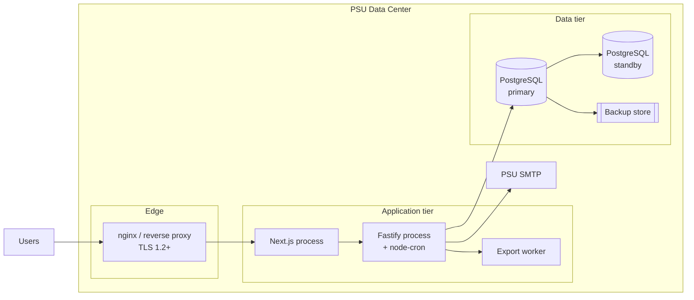

# Deployment

Covers environments, env vars, topology, pipeline, scheduler, backup /
DR, and observability. Satisfies SRS2.0 NFR-AVAIL and parts of NFR-PERF
and NFR-SEC.

## 1. Environments `[P1]`

| Env | Purpose | Branch | URL | Notes |
|---|---|---|---|---|
| dev | Engineer workstation / shared dev | `feature/*` | local | No real PSU Passport; use a dev IdP stub |
| staging | Pre-prod integration | `develop` | `eila-stg.psu.ac.th` (placeholder) | Real PSU Passport (staging client), synthetic data |
| prod | Live | `main` | `eila.psu.ac.th` (placeholder) | Real data, real PSU Passport |

Branch mapping follows CLAUDE.md Git Branch Strategy: `develop` →
staging, `main` → prod, hotfixes branch from `main` and merge back to
both.

## 2. Env Vars `[P1]`

| Name | Scope | Example | Secret? | Source |
|---|---|---|---|---|
| `NODE_ENV` | both | `production` | no | deployer |
| `PORT` | api | `4000` | no | deployer |
| `DATABASE_URL` | api | `postgres://eila:***@db/eila` | yes | secret store |
| `JWT_ACCESS_SECRET` | api | 32B random | yes | secret store |
| `JWT_REFRESH_SECRET` | api | 32B random | yes | secret store |
| `JWT_ACCESS_TTL_SEC` | api | `900` | no | deployer |
| `JWT_REFRESH_TTL_SEC` | api | `604800` | no | deployer |
| `SESSION_ABSOLUTE_TTL_SEC` | api | `28800` | no | FR-AUTH-17 |
| `SESSION_IDLE_TTL_SEC` | api | `1800` | no | FR-AUTH-16 |
| `PSU_PASSPORT_AUTHORIZE_URL` | api | URL | no | PSU docs |
| `PSU_PASSPORT_TOKEN_URL` | api | URL | no | PSU docs |
| `PSU_PASSPORT_CLIENT_ID` | api | string | yes | secret store |
| `PSU_PASSPORT_CLIENT_SECRET` | api | string | yes | secret store |
| `PSU_PASSPORT_REDIRECT_URL` | api | URL | no | deployer |
| `FALLBACK_FACULTY_ID` | api | UUID | no | DB seed (FR-AUTH-04) |
| `SMTP_HOST` | api | `smtp.psu.ac.th` | no | PSU ops |
| `SMTP_PORT` | api | `587` | no | PSU ops |
| `SMTP_USER` | api | string | yes | secret store |
| `SMTP_PASS` | api | string | yes | secret store |
| `SMTP_FROM` | api | `eila@psu.ac.th` | no | deployer |
| `EXPORT_TMP_DIR` | api | `/var/tmp/eila-exports` | no | deployer |
| `CRON_ENABLED` | api | `true` / `false` | no | deployer (disable cron on some replicas) |
| `APP_BASE_URL` | web | URL | no | deployer |
| `NEXT_PUBLIC_API_BASE` | web | URL | no | deployer |
| `LOG_LEVEL` | both | `info` | no | deployer |

Secrets never enter the repo. Load from the PSU secret store (or
environment-specific Vault). `.env.example` documents the full set.

## 3. Infrastructure Topology `[P1]`

Rough sizing for Phase 1 (NFR-PERF-01..03):

- Web: 2 replicas, 1 vCPU / 1 GB each.
- API: 2 replicas, 2 vCPU / 2 GB each.
- DB: Postgres 16, 4 vCPU / 8 GB, PITR enabled.
- Export worker: 1 replica, scales out by queue depth.

Scheduler runs inside the API process on a single designated replica
(set `CRON_ENABLED=true` on exactly one). Alternative: move to a
dedicated worker — deferred.

## 4. Pipeline `[P1]`

GitHub Actions stages, in order:

1. `lint` — ESLint + Prettier check.
2. `typecheck` — `tsc --noEmit` on web and api.
3. `test` — Vitest / Jest for unit + integration; Playwright smoke for
   critical flows.
4. `build:web` — `next build`.
5. `build:api` — `tsc` + bundle.
6. `migrate:dry-run` — `drizzle-kit check` against staging or prod.
7. `deploy` — push images / artifacts; run migrations; rolling restart.

Rules:

- `develop` → auto-deploys to staging after successful `test`.
- `main` → manual approval gate, then deploy to prod.
- Hotfix branches run the same pipeline; merge back to both `main` and
  `develop` after release.

## 5. Scheduler `[P1]`

node-cron jobs (single replica via `CRON_ENABLED`):

| Job | Cron | Purpose | SRS |
|---|---|---|---|
| URL validation | every 24 h at 02:00 | Re-check `url` HEAD; update `url_status` | FR-WEB-08, NFR-PERF-07 |
| Form auto-open | every 5 min | Transition draft → open when `open_at` <= now | FR-FORM-16 |
| Form auto-close | every 5 min | Transition open → closed when `close_at` <= now | FR-FORM-16 |
| Round auto-close | every 5 min | When round `close_date` <= now, close member forms | FR-ROUND-07 |
| Reminders | every 15 min | 3-day and 1-day reminders for pending responders | FR-NOTIF-03..06 |
| Email retry | every 1 min | Retry failed notifications at 1/5/15 min | FR-NOTIF-07..09 |
| Audit purge / archive | daily at 03:00 | Archive > 2 y, hard-delete > 7 y | FR-AUDIT-05, FR-AUDIT-06 |
| Refresh-token purge | every 1 h | Hard-delete rows with `expires_at < now() - interval '1 day'` | FR-DATA-05 |
| PDPA anonymize sweep | daily at 03:30 | Process approved requests | FR-DATA-08 |

All jobs emit metrics (success count, failure count, lag) and write to
`audit_log` on side-effecting actions (FR-DATA-09).

## 6. Backup & DR `[P1]`

Targets (NFR-AVAIL-02, NFR-AVAIL-03):

- RTO ≤ 4 h.
- RPO ≤ 1 h.

Policy:

- Full Postgres backup daily (NFR-AVAIL-04).
- Incremental / WAL archive hourly (NFR-AVAIL-05).
- Retention: 30 days in primary backup store (NFR-AVAIL-06).
- Off-site copy at a secondary PSU data center or equivalent failure
  domain (NFR-AVAIL-07).
- Quarterly restore drills (NFR-AVAIL-09) with written runbook.

Restore runbook outline (lives under `docs/design/ops/` once written —
out of scope for this doc):

1. Provision a fresh Postgres instance from the latest full backup.
2. Replay WAL to the target point.
3. Smoke-test `GET /health` and `/readyz`.
4. Flip DNS / reverse-proxy target.
5. Announce.

## 7. Observability `[P1]`

- **Logs** — pino JSON to stdout; shipped by the container runtime.
- **Metrics** — Prometheus-style `/metrics` endpoint on the API.
  Required counters / histograms (NFR-PERF-10):
  - API p50 / p95 / p99 per route.
  - DB pool in-use / waiting.
  - Export queue depth.
  - Scheduler job lag and failure count.
- **Traces** — OpenTelemetry optional for Phase 1; recommended for
  Phase 2 when scoring pipelines join.
- **Health** — `GET /health` returns
  `{ status, db, smtp, scheduler }` (NFR-AVAIL-08). `/readyz` returns
  503 until all dependencies are reachable.

## 8. Performance Targets

| Target | Value | SRS |
|---|---|---|
| Normal load | 200 concurrent | NFR-PERF-01 |
| Peak | 500 concurrent | NFR-PERF-02 |
| Stress | 800 concurrent, graceful degrade | NFR-PERF-03 |
| GET P95 | < 1.0 s | NFR-PERF-04 |
| POST / PATCH P95 | < 2.0 s | NFR-PERF-05 |
| Export P95 | < 10 s (queue acceptance) | NFR-PERF-06 |
| URL HEAD timeout | 5 s | NFR-PERF-07 |
| DB pool | min 20, max 100 | NFR-PERF-08 |
| Overload | queue exports, throttle bg jobs, 429 | NFR-PERF-09 |

## 9. Release Checklist `[P1]`

Before merging to `main`:

- [ ] Migrations include documented rollback.
- [ ] `drizzle-kit check` clean against prod snapshot.
- [ ] Feature flags (if any) default-off.
- [ ] Changelog entry updated.
- [ ] DR drill within the past quarter (for major releases).
- [ ] Smoke-test plan covering login, form submit, export, health.
